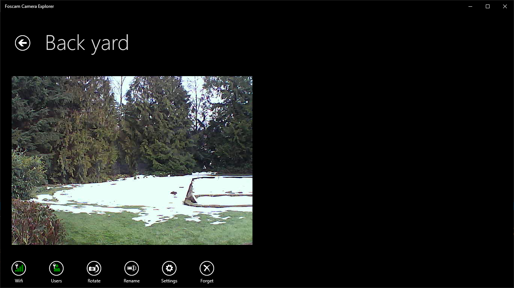

# FoscamExplorer

FoscamExplorer is a Windows Universal app that provides easy to use interface for interacting with your Foscam webcams.

Simply drag the mouse on the camera image to move the camera location in the direction you want it to go.

